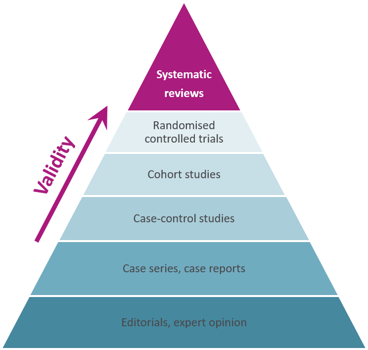

# Preclinical Systematic Reviews {#intro}

You're considering starting a preclinical Systematic Review (SR), what now? 
 

Keep scrolling to find out more about what a preclinical systematic review is, what the steps are, and how to complete them.
 

Use the table of contents bar on the left side of the screen to navigate along the steps of systematic review. 

## What is a systematic review? 

A systematic review (SR) is a literature review that involves systematically locating, appraising, and synthesising evidence from scientific studies to answer a defined research question based on pre-specified criteria.

The methods of a systematic review (and meta-analysis) should be transparent and reproducible, with the methods mapped out and reported so that the review can be repeated.

## What is a meta-analysis?

A method of combining quantitative results from individual studies identified through systematic review in an overall statistical analysis.

## Clinical & Preclinical Reviews

 

### Preclinical

Preclinical reviews tend to have lots of studies included. Included studies tend to have small sample sizes and varied experimental design. 
Preclinical reviews can be used to: 

- Investigate translational failure
- Explore differences between studies (heterogeneity) e.g. internal & external validity
- Inform future preclinical studies e.g. model selection
- Inform early phase clinical trials
- Explain discrepancies in preclinical vs. clinical trial results
- Inform 3Rs decisions

 

### Clinical 

Clinical reviews tend to have fewer included studies, included studies have larger sample sizes, and the variability between included studies is reduced with stricter inclusion criteria. 
Clinical reviews can be used to: 

- Explore heterogeneity e.g. clinical populations
- Inform later phase clinical studies
- Inform clinical practice and guidelines

 

## Why Perform Preclinical SRs? 

-  To summarise evidence from multiple similar studies to allow for more accurate estimates of effect
- The methods used to find and select studies are transparent and reproducible, reducing bias and increasing the likeliness of producing reliable and accurate conclusions. 
- Summarise findings from all available studies making information easier for the end user to read and understand
- Analyse individual study quality to inform confidence in the results
-  Quantitative synthesis of results (meta-analysis)
- Allow for evidence-based inferences

{#id .class width=50% height=50%}

 

The results of preclinical systematic reviews can:

-   Provide evidence to change research practice by identifying risks of bias in preclinical experiments
-   Influence development of reporting guidelines and editorial policies
-   Provide evidence to support reporting of positive, negative and neutral results through detection of publication bias
-   Identify study design features that compromise potential clinical application
-   Contribute to evidence-based clinical trial design

 
