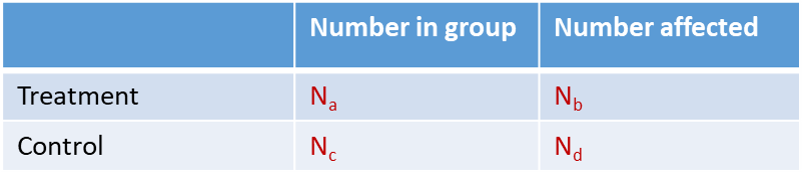

# Data Extraction

Extract relevant data as predefined in your protocol. 

It is best practice to extract data in duplicate, two independent reviewers, to prevent errors. 

 

## Study Characteristics

Study characteristics to extract from included articles include: 

- PICO information (e.g. age and sex of population, species and strain of animal, dose and timing of intervention, type and time of outcome assessment)

- Study Design information

- Study Quality information ([see below](#Quality-Assessment))

- Additional information (e.g. time between intervention and outcome assessment, any comorbidity information)

 

## Quantitative Data

Extracting quantitative and numerical data from included studies is necessary to perform meta-analysis to pool the effect sizes from 

Your outcomes of interest may be: 

- Dichotomous (e.g. mortality, tumour presence) {#id .class width=75% height=75%}

- Continuous (e.g. blood pressure, or weight loss) {#id .class width=75% height=75%}

- Count Data (e.g. number of events)

Data about your outcomes may be provided in various formats including: 

- In tables

- In text 

- In graphs

You may need to use tools such as [Adobe desktop ruler](https://helpx.adobe.com/acrobat/using/grids-guides-measurements-pdfs.html) or [WebPlotDigitizer](https://automeris.io/WebPlotDigitizer/) to extract numerical values (e.g. means and standard deviations (SD) or standard error of the mean (SEM) from graphs). Some studies may report values on a different scale. Be aware, you may  need to convert these to a scale that is common across all studies (e.g. log scale conversion). 

 