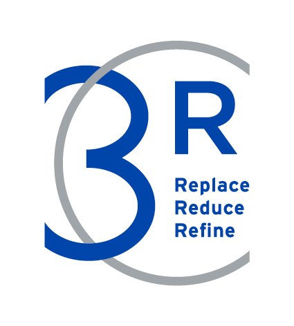

# About {#about}

We have put together this Wiki Page to provide information and documents, links, and useful tools to guide your through your preclinical systematic review. These resources have been put together using many CC-BY-4.0 sources including; [SyRF](http://syrf.org.uk/){target="_blank"}, and [Cochrane Interactive Learning](https://training.cochrane.org/interactivelearning){target="_blank"}. We thank these organisations and teams for making their resources available, definitely check out their resources as well! 

This resource was last updated on: `r format(Sys.time(), '%d %B, %Y')`

 

### To cite the tool

Preclinical Systematic Reviews & Meta-Analysis Wiki, (`r format(Sys.time(),  '%B, %Y')`), CAMARADES Berlin, QUEST-BIH Charité. Accessed from: https://www.CAMARADES.de

 

### Our Team

- **Sarah McCann, PhD**
- Torsten Rackoll, PhD
- Alexandra Bannach-Brown, PhD
- Florenz Cruz

 

If you have questions about the resources, or would like to ask a question about your specific review, get in touch: [Email us here](mailto:CAMARADES.berlin@charite.de)

This resource is supported by Charité 3Rs. For more information about 3Rs at Charité – Universitätsmedizin Berlin, visit the [Charité 3Rs Toolbox](https://charite3r.charite.de/en/charite_3r_toolbox/){target="_blank"}. 

{#id .class width=20%}

 
CAMARADES Berlin are located in the QUEST Center, Berlin Institute for Health

{#id .class width=30%}

