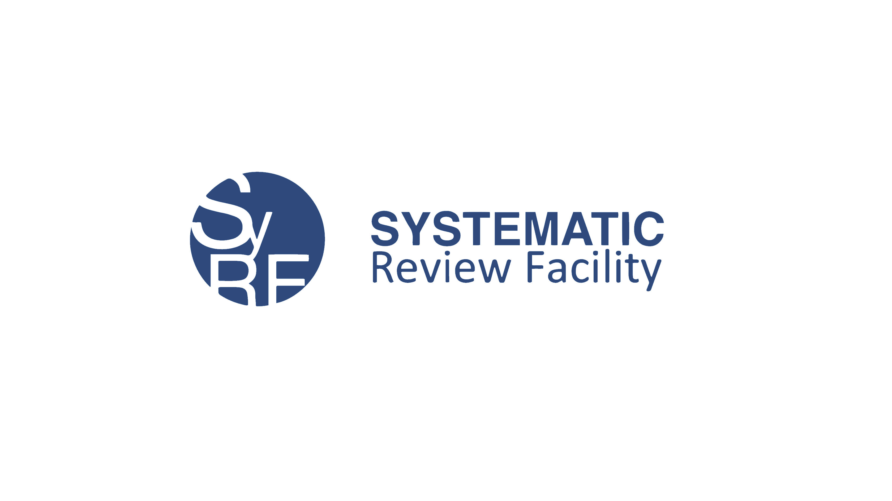

--- 
title: "Preclinical Systematic Review Wiki"
date: "`r Sys.Date()`"
site: bookdown::bookdown_site
documentclass: book
bibliography: [book.bib, packages.bib]
biblio-style: apalike
link-citations: yes
---
--- 
title: "Preclinical Systematic Review Wiki"
date: "`r Sys.Date()`"
site: bookdown::bookdown_site
documentclass: book
bibliography: [book.bib, packages.bib]
biblio-style: apalike
link-citations: yes
---

# Welcome

Hello, Systematic Reviewers!

Welcome to the CAMARADES Preclinical Systematic Review & Meta-Analysis Wiki. 

Find information, links, articles, and useful tools to guide you through your review. 
 

Navigate through the sections to find out more about what a preclinical systematic review is, what the steps are, and how to complete them.
 

Use the table of contents bar on the left side of the screen to navigate along the steps of a systematic review. 

 
If you have questions about the resources, or would like to ask a question about your specific review, please get in touch: 
[Email us here](mailto:CAMARADES.berlin@charite.de)

<!--chapter:end:index.Rmd-->

# Preclinical Systematic Reviews {#intro}

Placeholder

## What is a systematic review? 
## What is a meta-analysis?
## Clinical & preclinical reviews
## Why perform preclinical SRs? 

<!--chapter:end:01-intro.Rmd-->

# Systematic Reviews & 3Rs {#srs-3rs}

The principles of the 3Rs (Replacement, Reduction, and Refinement) are a framework for humane animal research. Systematic review is a valuable tool for advancing the 3Rs, primarily through the reduction and refinement of animal use in research. Using existing animal data, systematic reviews can contribute to improvements in animal studies including:

-   Providing reliable data to support sample size calculations for various experimental outcomes
-   Allowing comparison of the statistical performance of different experimental outcome measures
-   Characterising the extent to which subjecting animals to multiple tests contributes to additional knowledge
-   Assessing whether the same information can be provided by less invasive tests

 
For more examples of systematic reviews which implement 3Rs and animal welfare, please see [Ritskes-Hoitinga & van Luijk, 2019](https://www.mdpi.com/2076-2615/9/12/1163/htm){target="_blank"}. 

The Guidelines for Reporting Primary Animal Research are:  [ARRIVE 2.0](https://journals.plos.org/plosbiology/article?id=10.1371/journal.pbio.3000410){target="_blank"}

<!--chapter:end:02-srs-3rs.Rmd-->

# Before You Start {#b4ustart}

Placeholder

## Is it necessary?
## Has it been done before? 
## Is one already in progress?
## Build your systematic review team
### Collborating with your team

<!--chapter:end:03-b4ustart.Rmd-->

# Research Question {#researchquestion}

Placeholder

## Stakeholders
## Preclinical examples

<!--chapter:end:04-researchquestion.Rmd-->

# Protocol

Placeholder

## What is a protocol and why have one?
## Protocol templates
## Register your protocol
### Your protocol & 3Rs
## Protocol Development Workshops

<!--chapter:end:05-protocol.Rmd-->

# Systematic Search 

Placeholder

## Selecting databases {.tabset .tabset-fade .tabset-pills}
### PubMed
### Embase
### Web of Science
### Other sources & grey literature
## Search strategy development {.tabset .tabset-fade .tabset-pills}
### Step 1: Find keywords and synonyms for each element
### Step 2: Index/subject terms (database-specific)
### Step 3: Combining search terms using Boolean operators
### Precision & sensitivity 
### Tips & tricks
### Consulting an Information Specialist
## Combine search results
### Does the import order matter? YES!
## Deduplication
## Searching tools
## Find & retrieve full texts
### Tips & tricks for full text retrieval

<!--chapter:end:06-systematicsearch.Rmd-->

# Study Selection

Placeholder

## Inclusion & exclusion criteria  
## Apply your criteria
## Tools for screening

<!--chapter:end:07-studyselection.Rmd-->

# Data Extraction

Placeholder

## Study characteristics
## Quantitative data
## Data extraction software

<!--chapter:end:08-dataextraction.Rmd-->

# Quality Assessment

Placeholder

## Why assess study quality?
## Reporting quality
## Risk of bias / methodological quality
## RoB assessment to inform analysis

<!--chapter:end:09-qualityassessment.Rmd-->

# Meta-Analysis

Placeholder

## What is Meta-Analysis?
## Why perform Meta-Analysis?
## Meta-Analysis Tools
## Step 1. Calculate effect size 
### Continuous 
#### Mean Difference
#### Normalised Mean Difference
#### Standardised Mean Difference
### Dichotomous Outcomes
#### Odds Ratio
### Median
### True number of Controls
## Step 2. Combine effect sizes
### Fixed Effects Model
### Random Effects Model
## Step 3. Investigate heterogeneity
## Step 4. Reporting biases
## Step 5. Interpret the results 

<!--chapter:end:10-metaanalysis.Rmd-->

# Tools for Systematic Review

We highly recommend using software and tools to help you along the way. We have mentioned many tools throughout this Wiki, here is a list of all of them: 

[SyRF](https://syrf.org.uk/){target="_blank"}, the Systematic Review Facility, is a free-to-use online platform to support your preclinical systematic review. Its features and auxiliary tools include: 

- Deduplication of systematic searches [ASysD App](https://camarades.shinyapps.io/RDedup/){target="_blank"}
- Screening (title & abstract as well as full text)
- Data Annotation & Extraction tailored for animal experiments
- Meta-Analysis of data from SyRF [click here](https://camarades.shinyapps.io/meta-analysis-app/){target="_blank"}

**Additional tools include:** 

- Citation screening: [Rayyan](https://rayyan.qcri.org/welcome){target="_blank"} and [SysRev](https://sysrev.com/){target="_blank"}.
- Data extraction from graphs: [Adobe desktop ruler](https://helpx.adobe.com/acrobat/using/grids-guides-measurements-pdfs.html){target="_blank"} or [WebPlotDigitizer](https://automeris.io/WebPlotDigitizer/){target="_blank"} 
- Search translation across databases: [Polyglot Search Translator](https://sr-accelerator.com/#/polyglot){target="_blank"}

## Automated Tools for Systematic Reviews

With the increasing complexity and volume of research, automated tools such as machine learning and generative AI are being explored to assist in systematic reviews. These tools can help with tasks like literature screening, data extraction, and summarisation. However, it is essential to use them with caution:

- **Support, Not Replace Human Efforts:** While these tools can improve efficiency, systematic reviews still require critical human judgment and expertise.
- **Validation is Key:** Any automated tool must be rigorously tested and validated within your specific field before being implemented.
- **Task-Specific Assistance:** Current AI-driven tools can aid in certain steps of the process but are not capable of conducting a full systematic review independently.

If you are conducting a large systematic review and are interested in training a custom machine learning algorithm, [Contact us](mailto:camarades.berlin@charite.de) for more information.

## Systematic Online Living Evidence Summaries (SOLES)

Systematic Online Living Evidence Summaries (SOLES) provide a powerful framework for maintaining up-to-date, continuously evolving evidence in a given research domain. These platforms integrate automation, machine learning, and structured data management to streamline evidence synthesis and ensure that research teams always have access to the latest findings.

Capabilities and Benefits:

- **Automated Data Collection & Screening:** Reduces the burden of manual searches and updates, ensuring efficiency and accuracy.

- **Living Evidence Updates:** Enables real-time or scheduled updates, keeping systematic reviews current without requiring full re-analysis.

- **Scalability Across Domains:** SOLES can be adapted to any disease area, making them valuable for both emerging fields and established research topics.

- **Enhanced Collaboration:** Facilitates seamless knowledge sharing among researchers, policymakers, and clinicians.

- **Improved Decision-Making:** Supports evidence-based policy and clinical practice by ensuring that the most recent and relevant data are accessible.

For more details on SOLES, refer to the following sources:
- [Systematic Online Living Evidence Summaries](https://portlandpress.com/clinsci/article/137/10/773/233083/Systematic-online-living-evidence-summaries){target="_blank"}.

- [Recent Developments in SOLES applied to the Alzheimer's Disease field](https://www.sciencedirect.com/science/article/pii/S0165027024001547){target="_blank"}.

- [SOLES Projects Overview](https://camaradesuk.github.io/soles-projects/){target="_blank"}.

If your team is interested in developing a SOLES for your research domain, [get in touch with us](mailto:camarades.berlin@charite.de) to explore potential collaborations. 

<!--chapter:end:11-tools.Rmd-->

# Interpretation & Publication

Once you have conducted your systematic review, and potentially also conducted a meta-analysis, it is time to tell the community what you found and ensure the findings from your review reach your audience. 

## GRADE Approach
Be careful when interpreting the results; acknowledge sources of bias; consider heterogeneity, generalisability, and relevance. 

It may help to use the Preclinical Grade approach [Hooijmans et al., 2018 ](https://journals.plos.org/plosone/article?id=10.1371/journal.pone.0187271){target="_blank"} to rate the certainty of the evidence of preclinical animal studies, in the context of therapeutic interventions. 

## Good reporting

Report your systematic review in a way that allows reproducibility of the results and future updating. 

We recommend following the Preferred Reporting Items for Systematic Reviews and Meta-analyses (PRISMA-2020) Guidelines.  The checklist can be found [here.](https://www.prisma-statement.org/prisma-2020-checklist){target="_blank"} In addition, we recommend using the PRISMA Flowchart to visualise the studies in your systematic review process. The PRISMA Flowchart template can be [found here.](https://www.prisma-statement.org/prisma-2020-flow-diagram){target="_blank"}

<!--chapter:end:12-publication.Rmd-->

# Resources & Links

## Systematic Review Facility - CAMARADES
A SyRF is a free online platform to aid you in your systematic reviews and meta-analyses of in vivo studies. 

- [SyRF](https://syrf.org.uk/){target="_blank"}
- [SyRF Help Guide](https://help.syrf.org.uk/){target="_blank"}

## Templates & Guides

- [SYRCLE Protocol - Template & Paper](https://onlinelibrary.wiley.com/doi/epdf/10.1002/ebm2.7){target="_blank"}
- [Borenstein et al., 2009. Introduction to Meta-Analysis](https://onlinelibrary.wiley.com/doi/book/10.1002/9780470743386){target="_blank"}
- [Vesterinen et al, 2014. "Meta-analysis of data from animal studies: a practical guide." Journal of neuroscience methods](https://doi.org/10.1016/j.jneumeth.2013.09.010){target="_blank"}
- [Cochrane Handbook](https://training.cochrane.org/handbook/current){target="_blank"}
- [Cheat sheet](CheatSheet_IntroSRworkshop_2023.pdf){target="_blank"}: We have summarized the main points of our Introduction to SR workshop in this cheat sheet, including links to relevant references and resources. 

<!--chapter:end:13-resources.Rmd-->

# Workshops & Tutorials {#workshops}

Placeholder

## Workshops
## eLearning 
## Meta-Analysis Tutorial

<!--chapter:end:14-workshops.Rmd-->

# About {#about}

Placeholder

## To cite this resource
## Acknowledge our services
## Join the Systematic Review Community 
## Our Team

<!--chapter:end:15-About.Rmd-->

