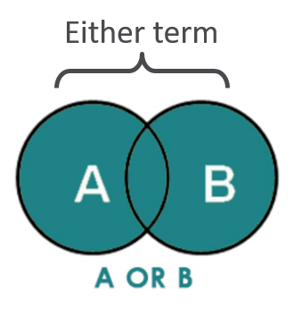
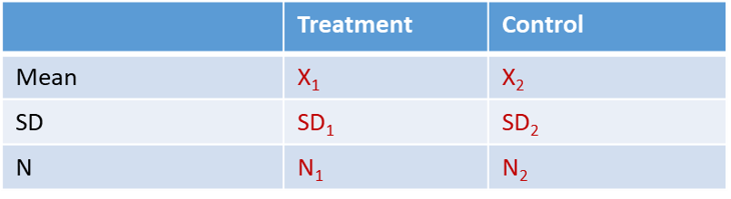
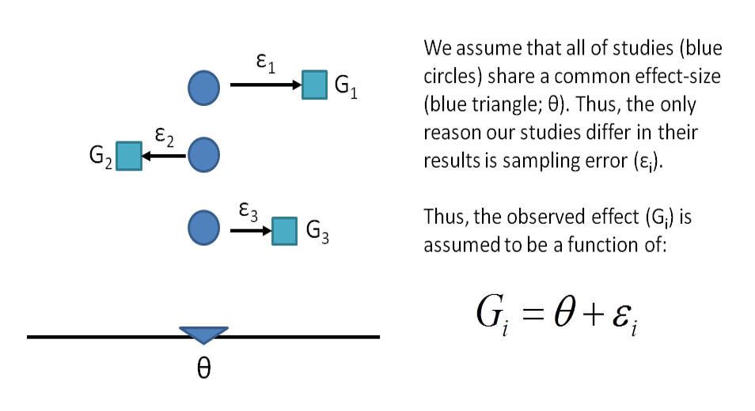
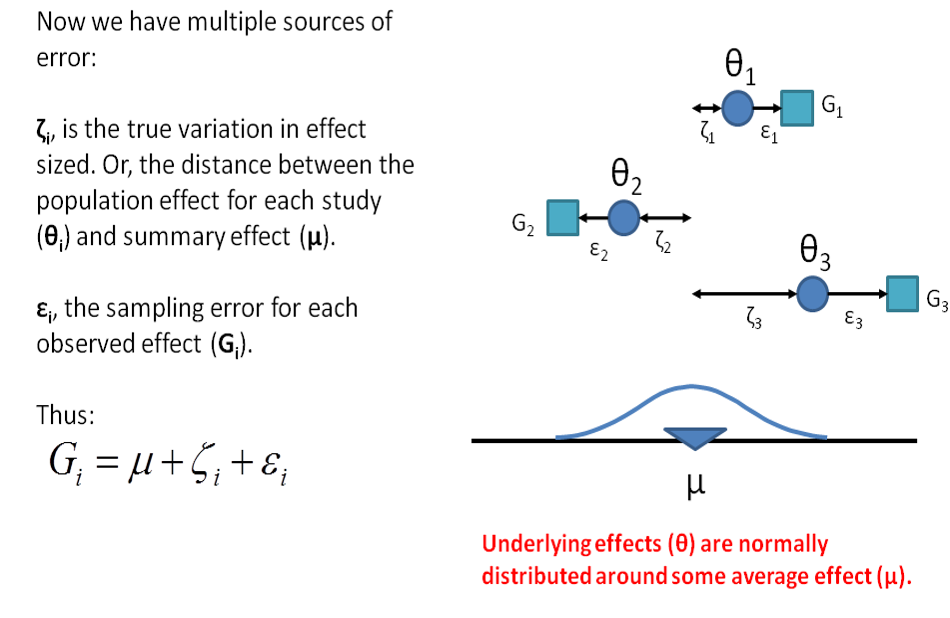

--- 
title: "Preclinical Systematic Review Wiki"
date: "`r Sys.Date()`"
site: bookdown::bookdown_site
documentclass: book
bibliography: [book.bib, packages.bib]
biblio-style: apalike
link-citations: yes
---

# Welcome

Hello, Systematic Reviewers!

Welcome to the CAMARADES Preclinical Systematic Review & Meta-Analysis Wiki. 

Find information, links, articles, and useful tools to guide you through your review. 
 

Navigate through the sections to find out more about what a preclinical systematic review is, what the steps are, and how to complete them.
 

Use the table of contents bar on the left side of the screen to navigate along the steps of a systematic review. 

 
If you have questions about the resources, or would like to ask a question about your specific review, please get in touch: 
[Email us here](mailto:CAMARADES.berlin@charite.de)

<!--chapter:end:index.Rmd-->

# Preclinical Systematic Reviews {#intro}
 

## What is a systematic review? 

A systematic review (SR) is a literature review that involves systematically locating, appraising, and synthesising evidence from scientific studies to answer a defined research question based on pre-specified criteria.

The methods of a systematic review (and meta-analysis) should be transparent and reproducible. This means that the methods are planned, conducted, and reported in a way that can be repeated by other research groups.

## What is a meta-analysis?

A meta-analysis is a method of combining quantitative results from individual studies identified through systematic review in an overall statistical analysis.

## Clinical & preclinical reviews

There are many differences between preclinical and clinical systematic reviews, which is why we developed this Wiki, specific to preclinical systematic review methodology.

<table>
<colgroup>
<col width="20%" />
<col width="40%" />
<col width="40%" />
</colgroup>
<thead>
<tr class="header">
<th align="left"> </th>
<th align="left">Preclinical</th>
<th align="left">Clinical</th>
</tr>
</thead>
<tbody>
<tr class="odd">
<td align="left"> # of included studies</td>
<td align="left"> High </td>
<td align="left"> Low </td>
</tr>
<tr class="even">
<td align="left">Sample size within studies</td>
<td align="left"> Low </td>
<td align="left"> High </td>
</tr>
<tr class="odd">
<td align="left"> Experimental design </td>
<td align="left"> Variable </td>
<td align="left"> Consistent </td>
</tr>
<tr class="even">
<td align="left"> Uses </td>
<td align="left">
<ul><li>Investigate translational failure</li><li>Explore differences between studies (heterogeneity) e.g. internal & external validity</li></ul><ul><li>Inform future preclinical studies e.g. model selection</li></ul><ul><li>Inform early phase clinical trials</li><li>Explain discrepancies in preclinical vs. clinical trial results</li></ul><ul><li>Inform 3Rs decisions</li></ul>
</td>
<td align="left"> <ul><li>Explore heterogeneity e.g. clinical populations</li><li>Inform later phase clinical studies</li></ul><ul><li>Inform clinical practice and guidelines</li></ul> </td>
</tr>
</tbody>
</table>

## Why perform preclinical SRs? 

There are many reasons to perform preclinical systematic reviews:

- To summarise evidence from multiple similar studies to allow for more accurate estimates of effect
- The methods used to find and select studies are transparent and reproducible, reducing bias and increasing the likeliness of producing reliable and accurate conclusions. 
- Summarise findings from all available studies making information easier for the end-user to read and understand
- Analyse individual study quality to inform confidence in the results
- Quantitative synthesis of results (meta-analysis)
- Allow for evidence-based inferences

{#id .class width=50% height=50%}

 

The results of preclinical systematic reviews can:

-   Provide evidence to change research practice by identifying risks of bias in preclinical experiments
-   Influence development of reporting guidelines and editorial policies
-   Provide evidence to support reporting of positive, negative and neutral results through detection of publication bias
-   Identify study design features that compromise potential clinical application
-   Contribute to evidence-based clinical trial design

 

<!--chapter:end:01-intro.Rmd-->

# Systematic Reviews & 3Rs {#srs-3rs}

The principles of the 3Rs (Replacement, Reduction, and Refinement) are a framework for humane animal research. Systematic review is a valuable tool for advancing the 3Rs, primarily through the reduction and refinement of animal use in research. Using existing animal data, systematic reviews can contribute to improvements in animal studies including:

-   Providing reliable data to support sample size calculations for various experimental outcomes
-   Allowing comparison of the statistical performance of different experimental outcome measures
-   Characterising the extent to which subjecting animals to multiple tests contributes to additional knowledge
-   Assessing whether the same information can be provided by less invasive tests

 
For more examples of systematic reviews which implement 3Rs and animal welfare, please see [Ritskes-Hoitinga & van Luijk, 2019](https://www.mdpi.com/2076-2615/9/12/1163/htm){target="_blank"}. 

The Guidelines for Reporting Primary Animal Research are:  [ARRIVE 2.0](https://journals.plos.org/plosbiology/article?id=10.1371/journal.pbio.3000410){target="_blank"}

<!--chapter:end:02-srs-3rs.Rmd-->

# Before You Start {#b4ustart}

There are a couple of things to check before you start your SR. Read more below. 

## Is it necessary?

Consider the following before starting your SR: 

- Does the question have contemporary relevance?
- Does the question have clinical importance or importance to informing animal experiment design? 
- Is there currently variation in practice?
- Is there uncertainty and debate in the field?
- Informing design of definitive animal experiment trial

## Has it been done before? 

Do a quick search on [PubMed](https://pubmed.ncbi.nlm.nih.gov/){target="_blank"} or the most commonly used bibliographic database in your field to check for published systematic reviews. We may also check preprint archives such as [bioRxiv](https://www.biorxiv.org/){target="_blank"}, [medRxiv](https://www.medrxiv.org/){target="_blank"} or [OSF](https://osf.io/){target="_blank"}, to see if a systematic review has been published as a preprint. Check for ongoing systematic reviews on [PROSPERO](https://www.crd.york.ac.uk/prospero/){target="_blank"}.

Questions to ask regarding existing systematic reviews in the field include: 

- Has the research question been adequately addressed? 
- Is the systematic review methodology used in the review of sound quality? 
- Is the research question specific or broad enough for your aim?
- How recently was the systematic review carried out?

There is no need to start a systematic review if a recent, existing, high-quality SR answers your research question. If there is a relevant SR that is not up-to-date, consider contacting the original author team to discuss their plans for updating the review or a potential collaboration. 

For additional reading on how to assess the quality of a published systematic review, see the PRISMA guidelines and other appropriate guidelines on the [EQUATOR web-page](https://www.equator-network.org/){target="_blank"}. 

## Is one already in progress?

Before you start, check that the review question you are interested in answering is not already being investigated by another research group. 

**Where can I find this information?**

Check places where a systematic review protocol may be preregistered or published, e.g. [PROSPERO](https://www.crd.york.ac.uk/prospero/){target="_blank"}, <a href="https://osf.io/">OSF</a>, [SyRF](https://syrf.org.uk/){target="_blank"}, preprint servers in your field e.g. [bioRxiv](https://www.biorxiv.org/){target="_blank"} or [medRxiv](https://www.medrxiv.org/){target="_blank"}. See more below: [Register Your Protocol](#register-your-protocol){target="_blank"}. 

If you don't find anything, go ahead and start your SR. 

If you find someone is working on the same or a similar question, contact the research team. Ask about their aims, methods, and at what stage of the SR they are, and if you can collaborate to achieve the common aim. 

## Build your systematic review team

A systematic review can take a long time, so ensure you have the adequate expertise and funding to complete the review. Get your colleagues to help out! And reach out to people outside of your immediate team for expert advice. 

- **Librarians:** Librarians and information specialists can help with refining your search strategy. They will have insights into which bibliographic databases contain literature on the fields and topics you are interested in. Librarians can support you to identify sources for grey literature(e.g. thesis documents, technical reports, etc), and they will be able to support you to find full text versions of articles you want to include in your review, especially if they are not available with your institutional subscription. 

- **Systematic Review Methodologists:** If you are new to the systematic review process, a methodologist will be able to help you plan and organise your review, give recommendations for software and tools, as well as meta-analysis support. 

- **Statistician** You may require additional advice from a statistician if you plan to conduct a meta-analysis. If this is the case, it's good to get them involved as early on in the review process as possible. 

- **Topic Experts:** Ensure you have researchers and other stakeholders with adequate topic knowledge in your team. 

- **Project Managers:** Undertaking a systematic review requires effective project management. Ensure there is a clear and dedicated project leader who will be overseeing the project for the entire process. The project lead maintains the overview, which stage is the review at, and invites different members onto the team when necessary. 

### Collborating with your team
Early on in the review process, decide a naming convention for documents and decide a place for storing all documents related to the review in shared location. You may need to go back to any stage in the review and revisit decisions or find information, so keep good records. Take thorough notes of decisions made along the SR process, any deviations from the protocol. Not only is this good practice and increases transparency, it can help to make sure all team members are on the same page. 

<!--chapter:end:03-b4ustart.Rmd-->

# Research Question {#researchquestion}

All systematic reviews start with a strong, concise research question. This serves as the back-bone for a good search strategy, as it determines the structure and sequence for your literature searches.

Commonly preclinical SR research questions follow a PICO or PECO stucture: 

- **(P)opulation, (P)articipants, or (P)roblem:** What are the characteristics of the population or participants (species, sex, developmental stage, risk factors, or for human participants demographics, pre-existing conditions, etc)? What is the condition or disease of interest?
- **(I)ntervention or (E)xposure:** What is the intervention or exposure under consideration for this population?
- **(C)omparison:** What is the alternative to the intervention (e.g. placebo, different drug, surgery)?
- **(O)utcome:** What are the relevant outcomes (e.g. quality of life, change in clinical status, morbidity, adverse effects, complications)?

There are other research question structures depending on your area or topic of interest, for example, diagnostic test reviews, and prognostic reviews. 
For more information, see this article on [Formulating Review Questions](https://journals.library.ualberta.ca/eblip/index.php/EBLIP/article/view/9741/8144){target="_blank"}.

## Stakeholders

It is important that you engage stakeholders early on in the review phase to ensure the research question and findings from the review are relevant. Consider the following: 
- Who will use the results of your systematic review?
- From their perspective, what are the relevant questions to ask?

## Preclinical examples

For reference, see examples of research questions for published reviews. 

*“What is the effect of antidepressants compared to vehicle or no treatment on infarct volume in animal models of ischaemic stroke?”*

- **P** - Animal models of ischaemic stroke  
- **I** - Antidepressants
- **C** - Vehicle or no treatment
- **O** - Infarct volume

<!--chapter:end:04-researchquestion.Rmd-->

# Protocol

## What is a protocol and why have one?

A systematic review protocol outlines why and how you are going to conduct your systematic review. It should include your research question, background and the systematic review methods that will be used, including plans for: 

* search strategy
* inclusion and criteria
* data extraction
* quality assessment
* data synthesis strategy
* quantitative meta-analysis strategy (where applicable)

Having a **pre-specified** protocol improves the methodological transparency of your systematic review and reduces the risk of introducing bias. Publishing your protocol allows others to locate reviews in progress and enables future replication. The process of putting together your protocol often involves communication between a number of key stakeholders, you may want to discuss it with an advisory group, external experts, or your funders.

## Protocol templates

We strongly recommend using a protocol template to ensure you have covered all the important information in your protocol.
 

__SYRCLE__ (SYstematic Review Centre for Laboratory animal Experimentation) have developed a protocol template tailored to the preparation, registration and publication of systematic reviews of animal intervention studies. [See the template and publication here](https://onlinelibrary.wiley.com/doi/epdf/10.1002/ebm2.7){target="_blank"}. 

It may be useful to look through examples of previously published protocols from [PROSPERO for Animals](https://www.crd.york.ac.uk/prospero/#searchadvanced){target="_blank"} while you formulate your protocol. You can also use PROSPERO to check that no systematic reviews on your research question are currently underway. For  examples of SYRCLE protocol templates, see the [SyRF Protocol Registry](https://syrf.org.uk/protocols/){target="_blank"} while you formulate your protocol. **Please note that the SyRF Protocol Registry is no longer accepting new protocol submissions. Please use PROSPERO.**

## Register your protocol

Making the protocol for your systematic review available to the community has a number of benefits: 

* it provides evidence that prespecified analyses were indeed prespecified; 
 
* allows others to comment on your approach; provides examples for others planning such reviews; 
 
* and can help you identify if other reviews in similar areas are already in progress. 

 

We recommend reading the publication ["Navigating PROSPERO4animals: 10 top tips for efficient pre-registration of your animal systematic review protocol"](https://link.springer.com/article/10.1186/s12874-024-02146-0){target="_blank"} which is an article that aims to help authors write and register a detailed systematic review protocol on PROSPERO4animals. 

 

__PROSPERO:__
The Centre for Reviews and Dissemination at University of York now publish Preclinical Systematic Review Protocols. You can search published protocols by title, date, contact person or institution. 
For more information on registering at PROSPERO, see their [website here](https://www.crd.york.ac.uk/prospero/){target="_blank"}. 

__OSF:__
You can preregister your systematic review project on the [Open Science Framework here](https://osf.io/prereg/){target="_blank"}.

 

### Your protocol & 3Rs

We recommend that you include a statement in your protocol outlining how your research will impact the 3Rs (Replacement, Reduction and Refinement) in animal use in research.  

## Protocol Development Workshops
CAMARADES Berlin offers a range of workshops on Systematic Review and Meta-Analysis of Animal Studies, including a workshop on protocol development.

__Protocol Development for Systematic Review of Animal Studies__
 
This workshop will cover the contents of a transparent and comprehensive preclinical systematic review protocol. It will cover the rationale behind registering your systematic review protocol and where to register. This workshop is aimed at researchers who already have a basic understanding of systematic reviews of animal data. For more information, please click here: [Protocol Development for Systematic Review of Animal Studies](https://www.bihealth.org/en/translation/innovation-enabler/quest-center/events/course/protocol-development-for-systematic-review-of-animal-studies){target="_blank"} 

<!--chapter:end:05-protocol.Rmd-->

# Systematic Search 

To identify relevant studies to include in your SR, you need to perform a comprehensive literature search based on a well-designed search strategy.

 

## Selecting databases {.tabset .tabset-fade .tabset-pills}

Bibliographic databases differ in their coverage of journals and indexing of articles, so to ensure your research is systematic, you will have to search multiple databases. 

Which databases you search will depend on your research area and question. For preclinical research, typical databases include:

* PubMed

* Embase

* Web of Science

A librarian or an expert in bibliographic databases will be able to help you identify other potential databases and construct database-specific search terms.

On top of electronic databases, you might want to use other methods to find relevant papers such as: scanning reference lists of relevant studies (both primary studies and reviews), hand searching key journals, contacting experts in the field, and searching additional relevant internet resources. Keep a record of alternative methods used and the data collected in a structured format.

### PubMed

[PubMed](https://pubmed.ncbi.nlm.nih.gov/){target="_blank"} is a bibliographic database comprising of more than 30 million citations for biomedical literature from MEDLINE, life science journals, and online books.

It is a free resource that supports the search and retrieval of biomedical and life sciences literature with the aim of improving health, and is maintained by the National Center for Biotechnology Information (NCBI) at the US National Library of Medicine. 

**Links & Resources:** 

* The [PubMed Advanced Search Builder](https://www.ncbi.nlm.nih.gov/pubmed/advanced){target="_blank"} is a useful tool to build your search query.

* Information on [MeSH Headings](https://www.nlm.nih.gov/mesh/meshhome.html){target="_blank"}.

### Embase

Embase is a biomedical research database covering literature from 1947 to present day. It indexes over 32 million records, including MEDLINE titles, as well as articles from 2,900 journals unique to Embase. 

You may access Embase directly or through Ovid depending on your library subscription. 

**Links & Resources:** 

* [Embase indexing and EmTree Headings](https://www.elsevier.com/solutions/embase-biomedical-research/embase-coverage-and-content){target="_blank"}

### Web of Science

Web of Science is a publisher-independent citation database. The Web of Science Core Collection indexes scholarly journals, books, and proceedings in the sciences, social sciences, and arts and humanities and can be used to navigate the full citation network.

Web of Science can also be used to search other databases including SciELO, KCI-Korean Journal Database and Zoological Record. 

### Other sources & grey literature

Other bibliographic databases include: 

- [Cochrane Central Register of Controlled Trials (CENTRAL)](https://www.cochranelibrary.com/central/about-central){target="_blank"}
- [Google Scholar](https://scholar.google.com/){target="_blank"}
- [Scopus](https://www.scopus.com/home.uri){target="_blank"}
- [Cumulative Index to Nursing and Allied Health Literature (CINAHL)](https://www.ebscohost.com/nursing/products/cinahl-databases/cinahl-complete){target="_blank"}
- [PsycINFO](https://www.apa.org/pubs/databases/psycinfo){target="_blank"}

Access may vary depending on institutional access. Document your search strategy so it is sufficiently reproducible. 

## Search strategy development {.tabset .tabset-fade .tabset-pills}

Select your search terms based around each of the PICO (or equivalent) concepts in your research question. 

### Step 1: Find keywords and synonyms for each element

A good exercise is to think of as many synonyms as possible for each of your main concepts or PICO elements.

For example:

If your research question is: *What is the effect of antidepressants compared to vehicle or no treatment on infarct volume in animal models of stroke?*

- **(P)opulation:** Stroke. Synonyms might include: cerebral ischaemia, cerebrovascular accident. 
- **(I)ntervention:** Antidepressants. Synonyms might include: fluoxetine, SSRIs

### Step 2: Index/subject terms (database-specific)

Each core database has their own system for indexing terms, topics, and subjects. Check what subject headings and indexing terms the databases you are interested in searching before you start. 

- MeSH terms (PubMed)
- Emtree terms (Embase)
(See more information about MeSH and EMTREE above [Selecting Databases](#Selecting-Databases){target="_blank"} )

**Why use both keywords and indexed terms in your search strategy?** 

Articles in PubMed are manually indexed but there is usually a slight delay. To capture all articles that use non-standard language, including recently published ones, you might miss some by using only a keyword search. 

### Step 3: Combining search terms using Boolean operators

Boolean operators include:

* AND

* OR

* NOT

The **OR** operator is used to connect two or more similar concepts (synonyms). It is used to broaden the results by telling the database that at least one of the search terms must be present in the results. 

The **AND** operator is used to narrow the results. It is used to tell the database that all search terms must be present in each result. 

{#id .class width=25% height=25%}
{#id .class width=25% height=25%}

### Precision & sensitivity 

A good search strategy aims to to **maximise sensitivity** while attempting to **maximise precision**. 

- **Precision** is the ability of search strategy to exclude irrelevant articles. 
- **Sensitivity** is the ability of a search strategy to identify all relevant articles. 

### Tips & tricks

- Consider differences in spelling (e.g. US vs UK English)
- Consider using other PubMed fields e.g. MeSH SubHeadings [SH], or Pharmacological Action [PA]. Find more information here: [PubMed Search Tags](https://pubmed.ncbi.nlm.nih.gov/help/#search-tags){target="_blank"}
- When using the NOT Boolean Operator, consider what relevant literature you might be excluding
- Consider truncation symbols or "wildcards" for your search (e.g. ischem* for ischemia and ischemic, etc). Check all bibliographic databases allow this before adding to your search
- The Polyglot Search Translator is a tool that will assist you in translating the syntax of your search string across various databases. For more information of the [Polyglot Search Translator see here](https://sr-accelerator.com/#/polyglot){target="_blank"}

### Consulting an Information Specialist
When developing a systematic search strategy, it is useful to consult an information specialist to make your search as precise and exhaustive as possible. Before contacting an information specialist, there are a couple of things to consider: 
  
- Make sure you have your research question clearly defined e.g., in a PICO format. 
  
- To provide them with more context on the aims of your review, be sure to include a couple of representative publications that you would include in your review. 
  
- Where possible, share a draft of your SR protocol and search strategy with them

## Combine search results

Once you have run your searches across multiple databases, you can combine your search results in a reference manager software, such as [EndNote](https://endnote.com/){target="_blank"} or [Zotero](https://www.zotero.org/){target="_blank"}.

To more easily find full text pdfs, remember to add you library subscription information into the settings or preferences of the reference manager, e.g. EzProxy information or OpenURL information. 

### Does the import order matter? YES!

The order that you import your references into Endnote or another reference manager matters. Different bibliographic databases have different quality or completeness of the references you are interested in, and reference managers use this information to deduplicate the results (the next step). 

The [recommended order](https://blogs.lshtm.ac.uk/library/2018/12/07/removing-duplicates-from-an-endnote-library/){target="_blank"} is: 

1. Medline
2. Embase
3. Medline in process (if included)
4. Other databases from OvidSP (PsycInfo, EconLit etc)
5. PubMed
6. Cinahl Plus
7. Other databases from Ebsco
8. Web of Science databases
9. Scopus
10. ProQuest databases
11. Cochrane databases
12. CRD databases
13. Any other databases
14. Clinical Trials websites

## Deduplication

As you have searched several different databases and other sources, there are likely duplicates or overlap. Time spent deduplicating your reference library will ensure you have accurate numbers (total records/included/excluded) to report and don't waste your time screening duplicates. 

Tools to help remove duplicate references include: 

- Endnote can be used to find and remove duplicate records. See [this resource.](https://support.clarivate.com/Endnote/s/article/EndNote-20-Steps-to-remove-duplicates-from-your-EndNote-library?language=en_US){target="_blank"}
- Stand-alone tools such as the [SR-Accelerator Tool](https://doi.org/10.1186/2046-4053-4-6){target="_blank"} and the [ASySD tool](https://camarades.shinyapps.io/ASySD/){target="_blank"} for preclinical reviews. 

## Searching tools

The Polyglot Search Translator is a tool that will assist you in translating the syntax of your search string across various databases. For more information of the [Polyglot Search Translator see here](https://sr-accelerator.com/#/polyglot){target="_blank"}. Please not this cannot be used as a simple translator without adequate review of the translation and thorough testing of the search. 

## Find & retrieve full texts
Once you have your library of unique references you can find and retrieve the full texts. 

1. Use your reference manager. Guides for retrieving from [Endnote](https://support.clarivate.com/Endnote/s/article/EndNote-Find-Full-Text-and-Ex-Libris-Alma-Primo-link-resolver?language=en_US)){target="_blank"} and [Zotero](https://www.zotero.org/support/locate){target="_blank"} can be found at the respective links. 
2. Search Online: Google search, GoogleScholar, ResearchGate, etc. 
3. Contact corresponding authors directly via email or Twitter. 
4. Last resort: ask your librarian to assist with inter-library loans. (NB: these can be very costly!)

### Tips & tricks for full text retrieval

- Add your Institutional Log-in information to the settings or preferences of the reference manager, e.g. [EzProxy](https://ezproxy-db.appspot.com/){target="_blank"} information or [OpenURL](https://www.zotero.org/support/locate/openurl_resolvers){target="_blank"} information, so you can more easily find the full texts that your institutional library has access to. 
- Be careful using custom scripts or other programs to bulk download as this can result in your institutional IP address being blocked
- If your search strategy has retrieved a lot of potentially relevant results, you may want to consider waiting to find the full texts until after you have carried out titles and abstract screening (see below). This will greatly reduce the number of full text records you need to find, and you will not waste time trying to find articles that are not relevant to your research question. 

<!--chapter:end:06-systematicsearch.Rmd-->

# Study Selection

Once you have found articles that may be potentially relevant to your research question, you now need to assess each article for relevance against predefined criteria. 

If applicable, you may consider doing this in two stages: 

1. Title or Title & Abstract Screening
2. Full text Screening

## Inclusion & exclusion criteria  

Defining the inclusion and exclusion criteria sets the boundaries for your review. 

- Inclusion criteria refer to everything a study must have to be included in your review. 
- Exclusion criteria refer to factors that make a study ineligible for inclusion. 

It is important the criteria are predefined, *a priori*, and applied consistently across all studies considered for the review. To ensure this, it is common to do citation screening in duplicate, two independent reviews, with discussion or a third independent reviewer to reconcile any discrepancies. 

Commonly your inclusion and exclusion criteria are defined around: 

* Type of study or study design
* Type of population (e.g. age, sex, disease model)
* Type of intervention (e.g. dosage, timing of intervention, frequency)
* Type of outcome Measures (e.g. parameters related to method of assessment or apparatus)

Additional factors you may want to consider: 

* Language restrictions
* Publication date restrictions 
* Type of publication (e.g. conference abstracts, peer-reviewed)

You may consider prioritising your inclusion and exclusion criteria based on what criteria you are likely to apply at title and abstract stage, and what criteria you can only apply after having read the full-text. 

## Apply your criteria

Is a study included or excluded in your review? Is a study relevant, or not relevant, to your research question based on your pre-defined criteria? 

To ensure your inclusion and exclusion criteria are applied in a unbiased, uniform fashion, it is good practice to have at least 2 independent screeners apply the criteria. If there are discrepancies in your decisions, you may discuss the discrepancies until you reach consensus or invite a 3rd independent reviewer to reconcile any differences. 

## Tools for screening

You can complete title and abstract screening & full text screening in [SyRF](https://syrf.org.uk/){target="_blank"}, the Systematic Review Facility, which is a free-to-use online platform to support your preclinical systematic review. 

SyRF randomly presents the order of articles to screeners and by default requires a consensus between multiple screeners. 

Other free-to-use platforms to perform citation screening include [Rayyan](https://rayyan.qcri.org/welcome){target="_blank"} and [SysRev](https://sysrev.com/){target="_blank"}. 

<!--chapter:end:07-studyselection.Rmd-->

# Data Extraction

The data you extract from each included study should be pre-specificed in your systematic review protocol. It is best practice to extract data in duplicate, two independent reviewers, to prevent errors. 

## Study characteristics

Study characteristics to extract from included articles may include: 

- PICO information (e.g. age and sex of population, species and strain of animal, dose and timing of intervention, type and time of outcome assessment)
- Study Design information
- Study Quality information ([see below](#Quality-Assessment){target="_blank"})
- Additional information (e.g. time between intervention and outcome assessment, any comorbidity information)

## Quantitative data

Extracting quantitative and numerical data from included studies is necessary to perform meta-analysis to pool the effect sizes from.

Your outcomes of interest may be: 

- **Dichotomous** (e.g. mortality, tumour presence) {#id .class width=75% height=75%}

- **Continuous** (e.g. blood pressure, or weight loss) {#id .class width=75% height=75%}

- **Count Data** (e.g. number of events)

Data about your outcomes may be provided in various formats including: 

- In tables
- In text 
- In graphs

You may need to use tools such as [Adobe desktop ruler](https://helpx.adobe.com/acrobat/using/grids-guides-measurements-pdfs.html){target="_blank"} or [WebPlotDigitizer](https://automeris.io/WebPlotDigitizer/){target="_blank"} to extract numerical values (e.g. means and standard deviations (SD) or standard error of the mean (SEM) from graphs). Some studies may report values on a different scale. Be aware, you may  need to convert these to a scale that is common across all studies (e.g. log scale conversion). 

In some cases it might not be clear if authors reported SEM or SD as a measure of variance. We recommend extracting the value as SEM as this is considered to be a more conservative approach from a meta-analysis perspective (assuming that the value of SD can only be larger). 

## Data extraction software

As you are extracting these pieces of information you will want to store them in the same place for easier, later synthesis and analysis. 

We recommend using [SyRF](https://syrf.org.uk/){target="_blank"} the Systematic Review Facility to extract and store your data. It is a free-to-use online platform where you can create custom data extraction forms for your review. Flexible questions types and question settings, as well as online format allow for easy data extraction for you and your review team to simultaneous extract data from included papers. For more information see the [SyRF Website](https://syrf.org.uk/){target="_blank"} and the [SyRF Help Guide](https://help.syrf.org.uk/){target="_blank"} to set up your free review project. 

<!--chapter:end:08-dataextraction.Rmd-->

# Quality Assessment

## Why assess study quality?

Low methodological quality can affect internal validity and introduce bias into the results of primary studies. Internal validity refers to the extent to which study results reflect the true cause-effect of an intervention. Different types of bias can influence internal validity (e.g. selection, performance, detection, and attrition biases).

**It is not impact. It is not novelty.** 

Bias in primary studies can lead to an over- or under-estimation of the true intervention effect in both primary studies and systematic reviews. It is important to consider the implications of study quality and validity for interpreting the results from your systematic review and it is often a good idea to incorporate a quality assessment section into your final report.

Study quality characteristics which have been shown to impact the results of preclinical studies include whether animals were randomised to control or treatment groups, and if researchers were blinded to intervention allocation or exposure when assessing outcomes.
Read more about allocation and blinding on the [NC3Rs Experimental Design Assistant website](https://eda.nc3rs.org.uk/experimental-design-allocation){target="_blank"}.
 

## Reporting quality

You can use a reporting quality checklist on primary studies in your systematic review. 

- The [CAMARADES Checklist](https://www.ahajournals.org/doi/pdf/10.1161/01.str.0000125719.25853.20){target="_blank"}
- [Nature Reporting Checklist](https://www.gene-quantification.de/checklist-for-life-sciences-articles.pdf){target="_blank"}. The operationalised checklist is available [here.](https://link.springer.com/article/10.1007/s11192-016-1964-8/tables/6){target="_blank"}

## Risk of bias / methodological quality
Use a Risk of Bias (RoB) tool to help you evaluate the methodological quality of a primary animal experiment. Tools that have been developed to assess bias and quality in preclinical studies include the [SYRCLE RoB tool](https://bmcmedresmethodol.biomedcentral.com/track/pdf/10.1186/1471-2288-14-43){target="_blank"}.

## RoB assessment to inform analysis

The extent to which a study is at risk of bias can hugely impact the findings. Findings from your risk of bias assessment should inform the conclusions of your systematic review. 

- Conduct sensitivity analysis (quantitatively using meta-analysis or qualitatively)
- Exclude studies at high risk of bias from the evidence synthesis (this should be done with **extreme caution** and prespecified in your protocol to avoid bias)
- Reach an overall conclusion for each outcome as to whether the synthesised result is at high risk of bias
- Use the overall conclusion to inform the summary assessment of certainty of the evidence using e.g. [GRADE approach](https://bestpractice.bmj.com/info/toolkit/learn-ebm/what-is-grade/){target="_blank"}

<!--chapter:end:09-qualityassessment.Rmd-->

# Meta-Analysis

## What is Meta-Analysis?

A meta-analysis is the statistical combination of results from two or more separate studies.

## Why perform Meta-Analysis?

Meta-analyses are performed for a variety of reasons:

- To provide a test with more power than separate studies
- To provide an improvement in statistical precision
- To summarise numerous and inconsistent findings
- To investigate consistency of effect across different samples

[(Reference: Cochrane Handbook)](https://training.cochrane.org/handbook/current){target="_blank"}

To understand the basics and for exact equations, keep reading. 

Equations shown below are from the following references, where more information can be found: 

- [Vesterinen et al, 2014. "Meta-analysis of data from animal studies: a practical guide." Journal of neuroscience methods](https://doi.org/10.1016/j.jneumeth.2013.09.010){target="_blank"}
- [Borenstein et al., 2009. Introduction to Meta-Analysis](https://doi.org/10.1002/9780470743386){target="_blank"}

 

## Meta-Analysis Tools

Luckily, statistical software takes care on most of the 'heavy lifting' when it comes to calculating effect sizes, pooling them, and making forest plots.
There are different tools available to perform meta-analysis. 

R is the recommended software as it is free and open source and supports transparent documentation of meta-analysis steps. To read more about R and download it for free, [see the R Project website here.](https://www.r-project.org/){target="_blank"} 
If this is your first time conducting a meta-analysis using R, you can practice with our meta-analysis tutorial, [read more in section 15.2.](#meta-analysis-tutorial){target="_blank"}

Other tools include:

* Stata
* Comprehensive Meta-Analysis
* RevMan

## Step 1. Calculate effect size 

The first step is to calculate the effect size for each outcome within each study. Your outcomes may be: 

- Continuous
- Dichotomous

### Continuous 
For **continuous outcomes**, commonly used effect size measures include:

- Mean Difference
- Normalised Mean Difference
- Standardised Mean Difference

#### Mean Difference
**Mean Difference:** Raw mean difference can be used when the outcomes are reported on a meaningful scale and all studies in the analysis use the same scale. The meta-analysis is performed directly on the raw difference in means. 

Mean Difference Effect Size:
$$ ES_i = \bar{x}_c - \bar{x}_\text{rx}$$

Standard Error: 
$$ SE_i = \sqrt{\frac {N}{n_{\text{rx}} \times n'_c} \times S_{\text{pooled}}^2} $$

where $S_{\text{pooled}}$ is: 
$$S_{\text{pooled}} = \sqrt \frac {(n'_c - 1)SD_c^2 + (n_{\text{rx}} - 1)SD_{\text{rx}}^2}{N -2} $$

#### Normalised Mean Difference
**Normalised Mean Difference:** Normalised mean difference (NMD) can be used when outcomes are on a ratio scale, where the score on a 'control' or 'sham' animal is known. The most common method to calculate NMD is as a proportion of the mean.

The effect size calculation for normalised mean difference: 

$$ES_i= 100 \times  \frac {(\bar{x}_c - \bar{x}_\text{sham}) - (\bar{x}_\text{rx} - \bar{x}_\text{sham})}{\bar{x}_c - \bar{x}_\text{sham}}$$ where $\bar{x}_\text{sham}$ is the mean score for the unlesioned/normal/untreated animal. 

The standard deviation calculations are as follows: 
$$SD_\text{c*} = 100 \times \frac {SD_c}{\bar{x}_c - \bar{x}_\text{sham}}$$ and $$SD_\text{rx*} = 100 \times \frac {SD_\text{rx}}{\bar{x}_\text{c} - \bar{x}_\text{sham}}$$

$$ES_i= 100 \times  \frac {(\bar{x_c} - \bar{x_\text{sham}}) - (\bar{x_\text{rx}} - \bar{x_\text{sham}})}{\bar{x_c} - \bar{x_\text{sham}}} $$ where $$\bar{x_\text{sham}} $$ is the mean score for the unlesioned/normal/untreated animal. 

The standard deviation calculations are as follows: 
$$SD_c* = 100 \times \frac {SD_c}{\bar{x_c} - \bar{x_\text{sham}}}$$ and $$SD_\text{rx*} = 100 \times \frac {SD_\text{rx}}{\bar{x_\text{rx}} - \bar{x_\text{sham}}}$$

Standard error of the effect size is: 
$$SE_i = \sqrt{ \frac{SD_\text{c*}^2}{n'_c} + \frac {SD_{rx*}^2}{n_{rx*}} }$$

#### Standardised Mean Difference
**Standardised Mean Difference:** (SMD), Cohen's d and Hedge's g. SMD is used when the scale of measurement differs across studies and it is not meaningful to combine raw mean differences. The mean difference in each study is divided by the study's standard division to create an index comparable across studies. 

Hedge's G SMD Effect Size: 
$$ES_i = \frac {\bar{x}_c - \bar{x}_\text{rx}}{S_{\text{pooled}}} \times (1 - \frac{3}{4N - 9})  $$
And standard error of the effect size is: 
$$ SE_i = \sqrt{ \frac{N}{n_{\text{rx}} \times n'_c} + \frac{ES_i^2}{2(N - 3.49)} }$$

### Dichotomous Outcomes
For **dichotomous outcomes** the most commonly used effect size measures for animal studies is odds ratio. 

#### Odds Ratio
**Odds Ratio**: For event data. The ratio of number of events to the number of non-events. It represents the odds that an outcome will occur given a particular exposure, compared to the odds of the outcome occurring without that exposure.

Odds Ratio Effect Size
$$ OR_i = \frac {a_i \times d_i}{b_i \times c_i}  $$

with the standard error of the odds ratio effect size: 
$$ SE(ln(OR_i)) = \sqrt{ (1/a_i)+(1/b_i)+(1/c_i)+(1/d_i) }   $$

In the meta-analysis of events, we might encounter a scenario where not a single event occured, in one or more groups. This is  particularly likely with the small samples in preclinical research. In the case of zero events, the OR is mathematically ill defined. Two remedies exist: 
1) adding 0.5 to all zero frequencies to study-specific 2x2 tables [(Weber et al., 2020)](https://onlinelibrary.wiley.com/doi/full/10.1002/jrsm.1460){target="_blank"}, 
or the preferred method,  2) to use the arcsine transformation of the frequencies. 

$$ arcsin \sqrt (a/a+b) - arcsin \sqrt(c/c+d) $$

While the arcsine difference is prefered from a mathematical point of view [(Rücker et al. 2008)](https://onlinelibrary.wiley.com/doi/abs/10.1002/sim.3511){target="_blank"}, the transformation leads to an abstract effect size that cannot be as readily interpreted as an OR. This transformation is thus recommended for determining statistical significance. 

You might come across **Risk Ratio** (or Relative Risk), the risk of an event in one group (e.g., exposed group) versus the risk of the event in the other group (e.g., non-exposed group), or **Hazard Ratio**, however these data are rarely seen in primary animal experiments. For more information of Risk Ratio in clinical systematic reviews, see the [Cochrane Handbook.](https://handbook-5-1.cochrane.org/chapter_9/box_9_2_a_calculation_of_risk_ratio_rr_odds_ratio_or_and.htm){target="_blank"}  

### Median
**Median Survival** or time to event data. The effect is calculated by dividing the median survival in the treatment group b the median in the control group, and the logarithm of that is taken. Read more about [median survival here.](https://systematicreviewsjournal.biomedcentral.com/articles/10.1186/s13643-021-01824-0){target="_blank"}

$$ ES_i = log (\frac{Median_{\rm rx}}{Median_c} ) $$

### True number of Controls

A single experiment can contain a number of comparisons. If the control cohort is serving more than one treatment group, we correct the number of animals reported in the control cohort by the number of treatment groups. 

(1) **True number of controls**
$$n'_c = \frac{n_c}{{\rm num. treatment groups}}$$

(2) **True N for each comparison**
$$N = n_{\text{rx}} + n'_c$$

(3) **Converting SEM to SD**
$$ SD_c = SEM_c \times \sqrt n_c $$ and $$SD_{\text{rx}} = SEM_{\text{rx}} \times \sqrt n_{\text{rx}} $$

## Step 2. Combine effect sizes

The next step is to combine the effect sizes for each comparison together in a meta-analysis model. 

Before you pool your effect sizes, you may conisder: 

**Weighting Effect Sizes:**
In meta-analysis it is usual to attribute different weights to each study in order to reflect relative contributions of individual studies to the total effect size. In animal study meta-analysis we weight the studies according to precision. More precise studies are given greater weight in the calculation of the effect size. We recommend using the inverse variance method, where individual effect sizes are multiplied by the inverse of their squared standard error:

$$W_i = \frac{1}{SE^2_i} $$
Where $${SE^2_i}$$ is the square standard error of the effect size calculated. 

This gives the weighted effect size of: 
$$W_iES_i = ES_i \times \frac{1}{SE^2_i} $$

**Nesting Effects:** 
Where several outcomes are reported and it is appropriate to combine them into a single statistic, we can "nest" outcomes. To do this we take each outcome, weight it by multiplication by the inverse of the variance for that outcome, sum these weighted values for all outcomes and divide by the sum of the weights. 

$$ES_{\theta\text{i}} = \frac{\sum_{i=1}^{k} W_iES_i}{\sum_{i=1}^{k} W_i} $$
Where $$W_i$$ is the measure of weight (e.g. inverse variance). $$W_iES_i $$ is the weighted effect size, and *k* denotes the total number of studies included in the meta-analysis. 

The standard error is calculated: 
$$SE_{\theta\text{i}} = \sqrt \frac{N_{comparisons}}{\sum_{i=1}^{k} W_i} $$

**Pooling Effect Sizes**

There are two commonly used models for pooling effect sizes: 

- Fixed Effect Model
- Random Effects Model 

The selection of which model to use should be stated in your protocol with *a priori*. The decision is based on the nature of the studies likely to be included in your review.   Random effects model is most commonly used in preclinical studies as we usually synthesise data from studies performed in different laboratories and we expect heterogeneity. We often synthesise data from experiments where the species, age, or sex of the animals are different, the intervention may be given at varying doses or at different times in relation to the outcome. We assume that these study design variables have an impact on the effects we see in studies. 

Rarely, when doing a systematic review of data from one specific laboratory, if all the studies in your meta-analysis were conducted using the same model induction, paradigms, and interventions, you may consider a fixed effect model (Borenstein et al., 2009).

### Fixed Effects Model

Under the fixed effect model we assume that there is one true effect size which is shared by all the included studies. It follows that the combined effect (global estimate) is our estimate of this common effect size.

 

{#id .class width=75%}

 

### Random Effects Model

- Under the random effects model we allow that the true effect could vary from study to study. E.g. the effect size might be a little higher if the patients are older; in rats vs. mice; if the study used a slightly more intensive or longer variant of the intervention etc.
- The studies included in the meta-analysis are assumed to be a random sample of the relevant distribution of effects, and the combined effect estimates the mean effect in this distribution.

 

{#id .class width=75%}

 

## Step 3. Investigate heterogeneity

The third step is to investigate potential sources of heterogeneity (pre-specified in your protocol). Heterogeneity is the variability between groups of studies caused by differences in: 

- study samples (e.g. species, sex)
- interventions of outcomes (e.g. dose, outcome measure type)
- methodology (e.g. design, quality)

Chi-squared $\chi^2$ (or Chi^2^) assess whether observed differences in results are compatible with chance alone. 
I^2^ describes the percentage of variability in effect estimates that is due to heterogeneity rather than sampling error or chance along. 

You can investigate heterogeneity using: 

- Sub-group analysis. Read more about [sub-group analysis here.](https://bookdown.org/MathiasHarrer/Doing_Meta_Analysis_in_R/subgroup.html){target="_blank"}
- Meta-regression model. Read more about [meta-regression here.](https://bookdown.org/MathiasHarrer/Doing_Meta_Analysis_in_R/metareg.html){target="_blank"}

## Step 4. Reporting biases

**Publication Bias** occurs when the results of published and unpublished studies differ systematically. Unfortunately, neutral and negative studies take longer to be published, remain unpublished, are less likely to be identified in systematic review, and this can lead to an overstatement of efficacy in meta-analysis. 

There are also other biases that may effect your systematic review including, **selective outcome reporting** and **selective analysis reporting**. 

We can test for potential publication bias in our data plotting our data on a **funnel plot**. 
The outer dashed lines indicate the triangular region within which 95% of studies are expected to lie, in the absence of both biases and heterogeneity. The solid vertical line refers to the line of no effect. Image from [Sterne et al., 2011](https://www.bmj.com/content/343/bmj.d4002){target="_blank"}

{#id .class width=50%}

If you do observe asymmetry in your funnel plot, there may be a number of sources: 

- **Reporting Biases**
  - Publication bias
  - Selective outcome reporting
  - Selective analysis reporting
  
  
- **Poor methodological quality (leading to inflated effects in smaller studies)**
  - Poor methodological design
  - Inadequate analysis
  - Fraud
  
  
- **True heterogeneity:** Effect size differs according to study size due to e.g. differences in the intensity of interventions, or in underlying risk between studies with different sizes. 
  
- **Artefacts:** Sampling variation can lead to an association between the intervention effect and its standard error. 

- **Chance:** Asymmetry may occur by change - motivating the use of statistical asymmetry tests. 

## Step 5. Interpret the results 

The forest plot or timber plot is the main graphical output or representation from a meta-analysis. 

Reading and understanding these plots will allow you to understand the findings from a meta-analysis. Meta-analyses of animal studies tend to include many studies with small sample sizes. Therefore, it is common to see preclinical meta-analyses graphically represented with a timber plot, a slight variation on the forest plot. 

Here is an example of a timber plot. In this meta-analysis the research question was: What is the effect of antidepressants compared vehicle or no treatment on infarct volume in animal models of ischaemic stroke? [McCann et al., 2014](https://doi.org/10.1161/STROKEAHA.114.006304){target="_blank"}

{#id .class width=60%}

**Outcome:**
A meta-analysis is conducted on a single outcome of interest at a time. The outcome of interest in this meta-analysis is Reduction in Infarct Volume, as displayed on the y-axis label. 

**Individual Study Effects:** 
In this meta-analysis there were 58 experiments included. Each black dot represents the effect size reported in a single experiment, the difference in outcome between the mean and the control group. Each black dot has thin black lines above and below the effect size, these represent the errors bars associated with the effect size reported. Individual study effect sizes are displayed in order of smallest to largest to highlight variation or heterogeneity in the literature. 

**Pooled Effect:** 
Here, the gray bar behind the black dots represents the combined or pooled effect size across all included experiments and its confidence intervals. In this example, the effect size is 27.3% (95% CI, 20.7%–33.8%). 

**Clinical Forest Plots:** A step-by-step guide to interpreting a forest plot from a typical clinical meta-analysis is available [here](https://s4be.cochrane.org/blog/2016/07/11/tutorial-read-forest-plot/){target="_blank"}. 

<!--chapter:end:10-metaanalysis.Rmd-->

# Tools for Systematic Review

We highly recommend using software and tools to help you along the way. We have mentioned many tools throughout this Wiki, here is a list of all of them: 

[SyRF](https://syrf.org.uk/){target="_blank"}, the Systematic Review Facility, is a free-to-use online platform to support your preclinical systematic review. Its features and auxiliary tools include: 

- Deduplication of systematic searches [ASysD App](https://camarades.shinyapps.io/RDedup/){target="_blank"}
- Screening (title & abstract as well as full text)
- Data Annotation & Extraction tailored for animal experiments
- Meta-Analysis of data from SyRF [click here](https://camarades.shinyapps.io/meta-analysis-app/){target="_blank"}

**Additional tools include:** 

- Citation screening: [Rayyan](https://rayyan.qcri.org/welcome){target="_blank"} and [SysRev](https://sysrev.com/){target="_blank"}.
- Data extraction from graphs: [Adobe desktop ruler](https://helpx.adobe.com/acrobat/using/grids-guides-measurements-pdfs.html){target="_blank"} or [WebPlotDigitizer](https://automeris.io/WebPlotDigitizer/){target="_blank"} 
- Search translation across databases: [Polyglot Search Translator](https://sr-accelerator.com/#/polyglot){target="_blank"}

__Machine Learning:__ 
If you are doing a very large systematic review, consider training a custom machine learning algorithm. [Contact us](mailto:camarades.berlin@charite.de) for more information. 

<!--chapter:end:11-tools.Rmd-->

# Interpretation & Publication

Once you have conducted your systematic review, and potentially also conducted a meta-analysis, it is time to tell the community what you found and ensure the findings from your review reach your audience. 

## GRADE Approach
Be careful when interpreting the results; acknowledge sources of bias; consider heterogeneity, generalisability, and relevance. 

It may help to use the Preclinical Grade approach [Hooijmans et al., 2018 ](https://journals.plos.org/plosone/article?id=10.1371/journal.pone.0187271){target="_blank"} to rate the certainty of the evidence of preclinical animal studies, in the context of therapeutic interventions. 

## Good reporting

Report your systematic review in a way that allows reproducibility of the results and future updating. 

We recommend following the Preferred Reporting Items for Systematic Reviews and Meta-analyses (PRISMA-2020) Guidelines.  The checklist can be found [here.](https://www.prisma-statement.org/prisma-2020-checklist){target="_blank"} In addition, we recommend using the PRISMA Flowchart to visualise the studies in your systematic review process. The PRISMA Flowchart template can be [found here.](https://www.prisma-statement.org/prisma-2020-flow-diagram){target="_blank"}

<!--chapter:end:12-publication.Rmd-->

# Resources & Links

## Systematic Review Facility - CAMARADES
A SyRF is a free online platform to aid you in your systematic reviews and meta-analyses of in vivo studies. 

- [SyRF](https://syrf.org.uk/){target="_blank"}
- [SyRF Help Guide](https://help.syrf.org.uk/){target="_blank"}

## Templates & Guides

- [SYRCLE Protocol - Template & Paper](https://onlinelibrary.wiley.com/doi/epdf/10.1002/ebm2.7){target="_blank"}
- [Borenstein et al., 2009. Introduction to Meta-Analysis](https://onlinelibrary.wiley.com/doi/book/10.1002/9780470743386){target="_blank"}
- [Vesterinen et al, 2014. "Meta-analysis of data from animal studies: a practical guide." Journal of neuroscience methods](https://doi.org/10.1016/j.jneumeth.2013.09.010){target="_blank"}
- [Cochrane Handbook](https://training.cochrane.org/handbook/current){target="_blank"}
- [Cheat sheet](CheatSheet_IntroSRworkshop_2023.pdf){target="_blank"}: We have summarized the main points of our Introduction to SR workshop in this cheat sheet, including links to relevant references and resources. 

<!--chapter:end:13-resources.Rmd-->

# Workshops & Tutorials {#workshops}

## Workshops

We offer a range of workshops on Systematic Review and Meta-Analysis of Animal Studies. 

__Introduction to Systematic Review & Meta-Analysis of Animal Studies__
 
Through a mix of lectures and hands-on practical activities and tutorials across 3 half days, you will learn the major steps required to undertake a systematic review and meta-analysis of preclinical animal studies. For information on our next workshop and to register, please click here: [Introduction to Systematic Review & Meta-Analysis of Animal Studies](https://www.bihealth.org/en/translation/innovation-enabler/quest-center/events/course/introduction-to-systematic-review-meta-analysis-of-animal-studies){target="_blank"}
 
We have summarized the main points of the workshop in this [Cheat sheet](CheatSheet_IntroSRworkshop_2023.pdf){target="_blank"}

 
__Protocol Development for Systematic Review of Animal Studies__
 
This workshop will cover the contents of a transparent and comprehensive preclinical systematic review protocol. It will cover the rationale behind registering your systematic review protocol and where to register. This workshop is aimed at researchers who already have a basic understanding of systematic reviews of animal data. For more information, please click here: [Protocol Development for Systematic Review of Animal Studies](https://www.bihealth.org/en/translation/innovation-enabler/quest-center/events/course/protocol-development-for-systematic-review-of-animal-studies){target="_blank"} 

 
__Critical Appraisal of Animal Studies__
 
This interactive practical workshop will explore study quality and risks of bias, internal and external validity, in scientific publications of animal experiments. Participants will gain hands-on experience critically appraising published animal experiments. For more information, please click here: [Critical Appraisal of Animal Studies](https://www.bihealth.org/en/translation/innovation-enabler/quest-center/events/course/critical-appraisal-of-animal-studies-practical-workshop){target="_blank"} 

## eLearning 
You can also learn about Systematic Review and Meta-Analysis of Animal Studies at your own pace by taking our eLearning course. Take a single module or multiple modules to suit your needs. Each module consists of a combination of self-paced presentations and interactive activities and quizzes, allowing you to go over the materials as many times as you need. Exercises and activites are designed to test your understanding of the materials covered. 

[--> Take me to the eLearning platform! ](https://courses.bihealth.org){target="_blank"} 

We currently have modules on the following topics: 
 
- Introduction to Systematic Review & Meta-Analysis of Animal Studies
 
- Systematic Literature Searching
 
- Defining a research question 
 
- Protocol Development 
 
- Citation Screening & Eligibility Criteria 
 
- Critical Appraisal of Animal Studies 
 
- Data Extraction 
 
- Meta-Analysis of Animal Studies 
 

For instructions on how to make a FREE user account, please see this step-by-step [instruction document here.](eLearning_course_account_guide.pdf) 

If you have any questions about the eLearning platform or encounter any technical difficulties, please contact us at [camarades.berlin@charite.de](mailto:CAMARADES.berlin@charite.de)

## Meta-Analysis Tutorial

[>>> Click here to launch the tutorial](https://camarades.shinyapps.io/R-MA-Tutorial/){target="_blank"}

 
We have created a web-based tutorial to complement the workshop: [Introduction to Systematic Review & Meta-Analysis of Animal Studies](https://www.bihealth.org/en/translation/innovation-enabler/quest-center/events/course/introduction-to-systematic-review-meta-analysis-of-animal-studies){target="_blank"}

The web-based app uses R programming language to work through a meta-analysis of animal data but you do not need any previous experience with R to complete the tutorial.
 

The tutorial uses examples data from the publication:

<a href="https://doi.org/10.1007/s12975-016-0489-z" target="_blank" rel="noopener noreferrer">

  McCann SK, Cramond F, Macleod MR *et al*. Systematic Review and 
  Meta-Analysis of the Efficacy of Interleukin-1 Receptor Antagonist in 
  Animal Models of Stroke: an Update. *Translational Stroke Research* 7, 395–406 (2016).

</a>

<!--chapter:end:14-workshops.Rmd-->

# About {#about}

We have put together this Wiki Page to provide information and documents, links, and useful tools to guide your through your preclinical systematic review. These resources have been put together using many CC-BY-4.0 sources including; [SyRF](https://syrf.org.uk/){target="_blank"}, and [Cochrane Interactive Learning](https://training.cochrane.org/interactivelearning){target="_blank"}. We thank these organisations and teams for making their resources available, definitely check out their resources as well! 

This resource was last updated on: `r format(Sys.time(), '%d %B, %Y')`

 

## To cite this resource

Preclinical Systematic Reviews & Meta-Analysis Wiki, (`r format(Sys.time(),  '%B, %Y')`), CAMARADES Berlin, QUEST-BIH Charité. Accessed from: https://www.CAMARADES.de

 

## Acknowledge our services

At CAMARADES we provide services to support researchers in conducting high-quality systematic reviews of preclinical evidence. Engaging with our support services can take many forms, from attending our drop-in sessions, email consultation, to one-on-one sessions for the duration of your project. Each project team and review topic is unique, and the level of support required can vary across the life-cycle of your project.  

As our services are free of charge, we greatly appreciate appropriate acknowledgement of our support in your published work.  

If you have utilised our support services, we would be grateful for acknowledgment in your published work. For example, *“We would like to thank [insert team member’s name] from CAMARADES Berlin, QUEST Center, Berlin Institute of Health @ Charité Universitätsmedizin for consultation [and/or support].”*

For more extensive support, which may span multiple stages of the project or forms of support, we typically join the review team as a co-author, given our assistance meets the criteria for authorship according to the [ICMJE recommendations](https://www.icmje.org/recommendations/browse/roles-and-responsibilities/defining-the-role-of-authors-and-contributors.html){target="_blank"} (see more below). In this case, potential authorship will be based on discussion and informed by the published guidance, according to the individual circumstances of the project. 

Your acknowledgement is essential to help us continue offering our services to the research community. We value your collaboration! 

The [ICMJE](https://www.icmje.org/recommendations/browse/roles-and-responsibilities/defining-the-role-of-authors-and-contributors.html){target="_blank"} recommends that authorship be based on the following 4 criteria: 

- Substantial contributions to the conception or design of the work; or the acquisition, analysis, or interpretation of data for the work; AND 
- Drafting the work or reviewing it critically for important intellectual content; AND
- Final approval of the version to be published; AND
- Agreement to be accountable for all aspects of the work in ensuring that questions related to the accuracy or integrity of any part of the work are appropriately investigated and resolved.

 

## Join the Systematic Review Community 
COReS is a project to build a community around preclinical evidence synthesis. The project aims to bring together primary researchers and evidence synthesists to form communities and providing infrastructure and support systems to empower the community in the performance of systematic reviews in a collaborative manner.  Join the community to improve the quality and value of preclinical research in biomedicine! 
 
+ Check out resources and practices for synthesisable animal research on the [COReS Hub.](www.cores-hub.io){target="_blank"}  
+ Stay up-to-date with Community News via the newsletter. [Sign up to the newsletter.](http://eepurl.com/h4hsMv){target="_blank"}  
+ Join the discussion forum to share ideas, work collaboratively, and connect with researchers and methodologists. [Make a free user account for the discussion forum here.](www.cores.zulipchat.com){target="_blank"}  
+ Follow the project on LinkedIn for regular update on education offers, talks, and project development. [Check out COReS on LinkedIn here.](https://www.linkedin.com/company/communities-for-open-research-synthesis/){target="_blank"}  
 
Find our more about joining the community on the [COReS Hub.](https://cores-hub.io/cores-join-the-community/){target="_blank"}

## Our Team

- **[Sarah McCann, PhD](https://www.bihealth.org/en/quest/teams/team/research-group-mccann){target="_blank"}**
- Torsten Rackoll, PhD
- Alexandra Bannach-Brown, PhD
- Sofija Vojvodic, MSc

 

For more information on our team and our services and projects, please see the [BIH QUEST website.](https://www.bihealth.org/en/quest/service/service/camarades-facility-for-the-systematic-review-and-meta-analysis-1){target="_blank"}

 

If you have questions about the resources, or would like to ask a question about your specific review, get in touch: [Email us here](mailto:CAMARADES.berlin@charite.de)

This resource is supported by Charité 3Rs & VolkwagenStruftung. 

{#id .class width=20%}

{#id .class width=50%}

For more information about 3Rs at Charité – Universitätsmedizin Berlin, visit the [Charité 3Rs Toolbox](https://charite3r.charite.de/en/charite_3r_toolbox/){target="_blank"}. 

 
CAMARADES Berlin are located in the QUEST Center, Berlin Institute for Health

{#id .class width=30%}

 
 
For more information about CAMARADES in Edinburgh, [please click here.](https://www.ed.ac.uk/clinical-brain-sciences/research/camarades){target="_blank"}

<!--chapter:end:15-About.Rmd-->

